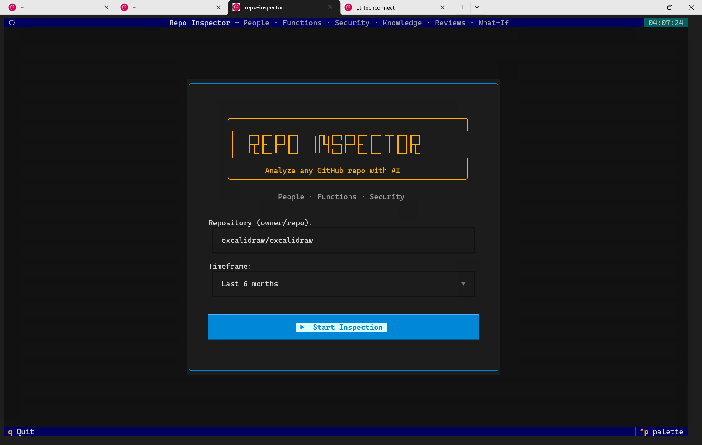
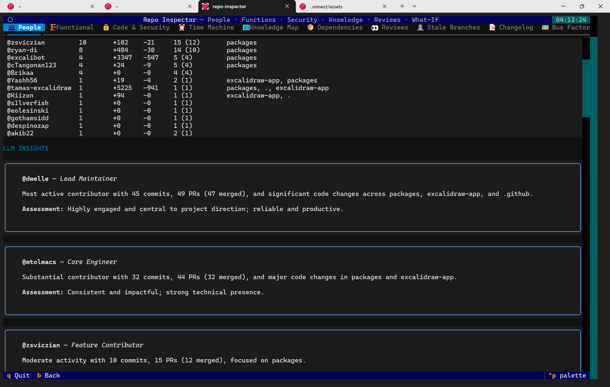
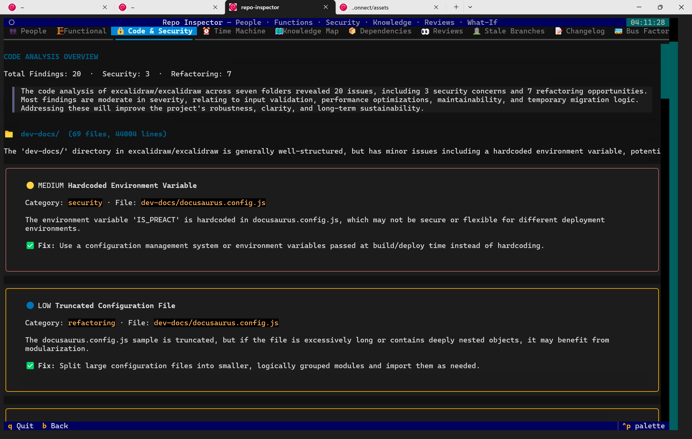

# 🔍 Repo Inspector

<p align="center">
  <strong>A powerful TUI tool that delivers comprehensive GitHub repository analysis using the GitHub Copilot SDK</strong>
</p>

<p align="center">
  
  
  
</p>

---

**Repo Inspector** analyzes any GitHub repository and provides actionable insights across **people**, **code quality**, **security**, and **team dynamics**. It combines deterministic metrics with LLM-powered intelligence to surface risks, identify knowledge silos, and help teams make better decisions.

<p align="center">
  
</p>

## ✨ Features

### Core Analysis

| Analysis              | Description                                                                                                       |
| --------------------- | ----------------------------------------------------------------------------------------------------------------- |
| **👥 People**          | Contributor stats (commits, lines, PRs, issues) + LLM-inferred roles, activity judgments, and risk identification |
| **🏗 Functional**      | Auto-discovers codebase structure with architecture commentary and improvement suggestions                        |
| **🔒 Code & Security** | Per-folder code quality scoring, refactoring opportunities, and security vulnerability detection                  |

<p align="center">
  
  <br><em>People — Top contributors with LLM-inferred roles</em>
</p>

<p align="center">
  
  <br><em>Code & Security — Per-folder quality scores and vulnerability detection</em>
</p>

### Extended Insights

| Feature                 | Description                                                                  |
| ----------------------- | ---------------------------------------------------------------------------- |
| **🗺 Knowledge Map**     | Heatmap of contributor expertise across folders — identifies knowledge silos |
| **📊 Bus Factor**        | Calculates key-person dependency risk with mitigation recommendations        |
| **🔄 Review Culture**    | Analyzes PR review patterns, bottlenecks, and reviewer relationships         |
| **⏰ Time Machine**      | Compares two timeframes to track team evolution and trend analysis           |
| **🌿 Stale Branches**    | Identifies abandoned branches and cleanup candidates                         |
| **📦 Dependencies**      | Scans and analyzes project dependencies across ecosystems                    |
| **📝 Changelog**         | Auto-generates changelogs from commits and merged PRs                        |
| **🤔 What-If Simulator** | Simulates scenarios like "What if contributor X leaves?"                     |
| **🚨 Bus Mitigation**    | Actionable plans to reduce single-point-of-failure risks                     |

### Additional Capabilities

- **📝 Issue Creation** — Create GitHub issues directly from findings with LLM-drafted content
- **🎨 Beautiful TUI** — Full-featured Textual interface with tabs, scrolling, and keyboard navigation
- **⚡ Real-time Progress** — Live status updates during analysis

---

## 🚀 Quick Start

### Prerequisites

- **Python 3.11+**
- **GitHub Copilot CLI** — [Install and authenticate](https://docs.github.com/en/copilot)
- **GitHub Token** — Personal access token with repo read permissions

### Installation

```bash
# Clone the repository
git clone https://github.com/olivomarco/repo-inspector.git
cd repo-inspector

# Create virtual environment
python -m venv .venv
source .venv/bin/activate  # Linux/macOS
# .venv\Scripts\activate   # Windows

# Install with development dependencies
pip install -e ".[dev]"
```

### Run

```bash
# Set your GitHub token
export GITHUB_TOKEN=your_token_here
# Or use GitHub CLI:
export GITHUB_TOKEN=$(gh auth token)

# Launch the TUI
repo-inspector
```

---

## 🖥 Usage

### Interactive TUI Flow

```
┌─────────────────────────────────────────────────────────────┐
│  1. Enter repository (owner/repo)                           │
│  2. Select timeframe (default: 1 month)                     │
│  3. Watch real-time analysis progress                       │
│  4. Explore results across multiple tabs                    │
│  5. Create GitHub issues from findings                      │
└─────────────────────────────────────────────────────────────┘
```

### Keyboard Shortcuts

| Key                 | Action                |
| ------------------- | --------------------- |
| `Tab` / `Shift+Tab` | Navigate between tabs |
| `↑` / `↓`           | Scroll content        |
| `Enter`             | Select / Confirm      |
| `b`                 | Go back               |
| `q`                 | Quit                  |

---

## 🏗 Architecture

```
repo-inspector/
├── TUI Layer (Textual)
│   ├── HomeScreen      → Repository & timeframe input
│   ├── LoadingScreen   → Real-time progress display
│   ├── ResultsScreen   → Tabbed analysis results
│   └── IssueScreen     → GitHub issue creation
│
├── Analyzer (Orchestrator)
│   ├── GitHubFetcher   → REST API data collection (httpx)
│   ├── RepoCloner      → Local clone & file analysis (GitPython)
│   └── Copilot SDK     → LLM-powered insights
│
└── Analysis Modules
    ├── people.py           → Contributor statistics
    ├── functional.py       → Codebase structure discovery
    ├── code.py             → Code quality analysis
    ├── knowledge_map.py    → Expertise heatmap
    ├── review_culture.py   → PR review patterns
    ├── time_machine.py     → Temporal comparisons
    ├── stale_branches.py   → Branch cleanup analysis
    ├── dependencies.py     → Dependency scanning
    ├── changelog.py        → Auto-generated changelogs
    ├── what_if.py          → Scenario simulation
    └── bus_mitigation.py   → Risk mitigation plans
```

---

## 🔧 Configuration

### Environment Variables

| Variable       | Description                           | Required |
| -------------- | ------------------------------------- | -------- |
| `GITHUB_TOKEN` | GitHub personal access token          | Yes      |
| `GH_TOKEN`     | Alternative token variable (fallback) | No       |

### Using a `.env` File

Create a `.env` file in the project root:

```env
GITHUB_TOKEN=ghp_your_token_here
```

### Token Permissions

For full functionality, your token needs:
- `repo` — Access to repository data
- `read:org` — For organization repositories (if applicable)

> **Note:** For SAML-protected organizations, authorize your token via **GitHub → Settings → Tokens → Configure SSO**.

---

## 🧪 Development

### Running Tests

```bash
# Run all tests
pytest

# Run with verbose output
pytest -v

# Run with coverage report
pytest --cov=src/repo_inspector --cov-report=term-missing --cov-report=html

# Run only failed tests
pytest --lf
```

### Code Quality

```bash
# Lint check
ruff check src/ tests/

# Auto-fix lint issues
ruff check --fix src/ tests/

# Format code
ruff format src/ tests/

# Type checking
mypy src/
```

### Project Structure

```
src/repo_inspector/
├── __init__.py
├── cli.py              # CLI entry point
├── app.py              # Textual TUI application
├── models.py           # Pydantic data models
├── fetcher.py          # GitHub REST API client
├── cloner.py           # Git clone utilities
├── analyzer.py         # Analysis orchestrator
├── analysis/           # Analysis modules
│   ├── people.py
│   ├── functional.py
│   ├── code.py
│   ├── knowledge_map.py
│   ├── review_culture.py
│   ├── time_machine.py
│   ├── stale_branches.py
│   ├── dependencies.py
│   ├── changelog.py
│   ├── what_if.py
│   └── bus_mitigation.py
└── screens/            # TUI screens
    ├── home.py
    ├── loading.py
    ├── results.py
    └── issue.py

tests/
├── conftest.py         # Pytest fixtures
├── test_models.py
├── test_fetcher.py
├── test_generator.py
└── test_cli.py
```

---

## 📦 Tech Stack

| Component           | Technology                                                  |
| ------------------- | ----------------------------------------------------------- |
| TUI Framework       | [Textual](https://textual.textualize.io/)                   |
| Terminal Formatting | [Rich](https://rich.readthedocs.io/)                        |
| HTTP Client         | [httpx](https://www.python-httpx.org/)                      |
| Data Validation     | [Pydantic v2](https://docs.pydantic.dev/)                   |
| Git Operations      | [GitPython](https://gitpython.readthedocs.io/)              |
| AI/LLM              | [GitHub Copilot SDK](https://github.com/github/copilot-sdk) |
| Testing             | [pytest](https://pytest.org/)                               |
| Linting             | [Ruff](https://docs.astral.sh/ruff/)                        |

---

## 📄 License

This project is licensed under the **MIT License** — see the [LICENSE](LICENSE) file for details.

---

<p align="center">
  Built with ❤️ by the Hackfest Team
</p>
